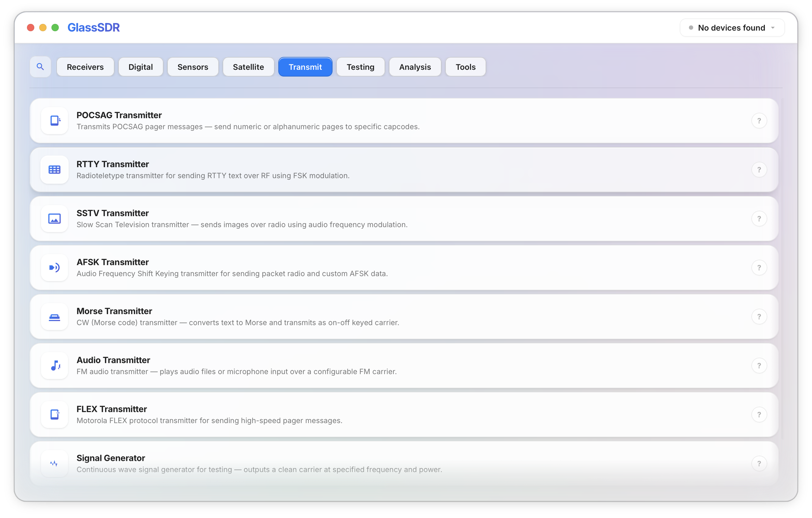

<p align="center">
  
</p>

<p align="center">
  <strong>A beautiful, open-source software-defined radio platform built for learning.</strong>
</p>

<p align="center">
  <a href="#-getting-started"><strong>Get Started</strong></a> &nbsp;&middot;&nbsp;
  <a href="#-every-app"><strong>Every App</strong></a> &nbsp;&middot;&nbsp;
  <a href="#-the-stack"><strong>The Stack</strong></a> &nbsp;&middot;&nbsp;
  <a href="#-contributing"><strong>Contributing</strong></a>
</p>

<p align="center">
  
  
  
  
  
</p>

<p align="center">
  
</p>

---

## What is GlassSDR?

GlassSDR is a desktop application that turns a [$20 USB radio dongle](https://www.rtl-sdr.com/) or a [HackRF One](https://greatscottgadgets.com/hackrf/) into a full radio laboratory. It ships as a **single binary** — no GNURadio, no Python, no driver headaches.

The entire signal processing pipeline runs in **Rust**. The UI is a glassmorphism-styled **React** app rendered by **Tauri**. You plug in your radio, pick an app from the home screen, and start receiving.

### Why does this exist?

The only comparable tool for HackRF is the **Mayhem/Portapack** firmware — a C++ codebase designed for the Portapack LCD that prioritizes offensive capabilities (replay attacks, GPS spoofing, jamming) with minimal educational context. It teaches through exposure to attack tools, not through understanding.

**GlassSDR takes the opposite approach:**

| | Portapack Mayhem | GlassSDR |
|---|---|---|
| **Runs on** | HackRF + Portapack H1/H2 (embedded LCD) | Any desktop (macOS, Linux, Windows) |
| **Philosophy** | Offensive RF toolkit | Educational RF platform |
| **UI** | 320×240 embedded touchscreen | Full desktop with waterfall, maps, controls |
| **Visualization** | Minimal spectrum display | Live waterfall, aircraft maps, protocol decode views |
| **Signal chain** | Hidden in C++ firmware | Transparent Rust DSP blocks you can read & modify |
| **Protocol decode** | Raw hex output | Structured decode with field labels & explanations |
| **Transmit safety** | No regulatory gates | Legal banner + arm/disarm gate on every TX mode |
| **Extensibility** | Fork the firmware | Add a Rust file, implement the `App` trait |

GlassSDR makes software-defined radio **approachable**. Every protocol decoder shows you what the bits mean. Every DSP block is a readable Rust function. The waterfall shows you the RF spectrum in real time. You learn by *seeing* the signal, not by staring at hex dumps.

---

## Getting Started

### Hardware

GlassSDR works with:

- **HackRF One** (1 MHz – 6 GHz, RX + TX) — primary target
- **RTL-SDR** (24 MHz – 1.7 GHz, RX only) — planned via SoapySDR

### Prerequisites

| Requirement | Version | Notes |
|---|---|---|
| **Rust** | 1.75+ | `rustup update stable` |
| **Node.js** | 18+ | Frontend build |
| **Tauri CLI** | 2.x | `cargo install tauri-cli` |
| **libusb** | 1.0 | USB access for SDR hardware |

**macOS:**
```bash
brew install libusb
```

**Ubuntu / Debian:**
```bash
sudo apt install libusb-1.0-0-dev libudev-dev pkg-config
```

**Windows:**
Install [Zadig](https://zadig.akeo.ie/) and assign the WinUSB driver to your SDR device.

### Build & Run

```bash
git clone https://github.com/JackHars/GlassSDR.git
cd GlassSDR

# Install frontend dependencies
cd frontend && npm install && cd ..

# Run in development mode (hot-reload)
cargo tauri dev

# — or build a release binary —
cargo tauri build
```

The release build produces a single self-contained app. No runtime dependencies.

---

## Every App

GlassSDR ships with **81 apps** across 7 categories. Every app is accessible from the home screen — just tap to launch.

### Receivers

| App | Description |
|-----|-------------|
| **NFM Audio** | Narrowband FM receiver for two-way radio, walkie-talkies, and public safety communications. |
| **Wideband FM** | Wideband FM receiver for commercial broadcast radio stations (88–108 MHz). |
| **AM Receiver** | Amplitude modulation receiver for AM broadcast, aviation, and shortwave radio. |
| **USB Receiver** | Upper sideband receiver for amateur radio and HF communications. |
| **LSB Receiver** | Lower sideband receiver for amateur radio below 10 MHz. |
| **CW Receiver** | Continuous wave (Morse code) receiver with narrow filter for CW signals. |
| **RDS Decoder** | Extracts station name, song info, and traffic data from FM broadcasts. |
| **ADS-B Receiver** | Aircraft tracking on 1090 MHz — positions on a live map with callsign, altitude, and speed. |
| **ADS-B Extended** | Enhanced ADS-B with extended squitter decoding, aircraft database, and flight path history. |

### Digital

| App | Description |
|-----|-------------|
| **APRS Receiver** | Amateur radio position reports and messaging on 144.39 MHz. Stations appear on map. |
| **AIS Receiver** | Maritime vessel tracking on 161.975/162.025 MHz with MMSI, name, course, and speed. |
| **ACARS Decoder** | Airline datalink messages — flight info, OOOI events, and free text. |
| **POCSAG Receiver** | Pager protocol decoder — intercepts numeric and alphanumeric pages with capcode. |
| **FLEX Receiver** | Motorola FLEX high-speed paging protocol decoder (1600/3200/6400 baud). |
| **AFSK Decoder** | Audio Frequency Shift Keying decoder for packet radio and AFSK-modulated data. |
| **DMR Receiver** | Digital Mobile Radio decoder for unencrypted DMR trunked radio systems. |
| **dPMR Receiver** | Digital Private Mobile Radio decoder for dPMR protocol communications. |
| **P25 Receiver** | Project 25 decoder for public safety and law enforcement radio systems. |
| **NXDN Receiver** | NXDN digital voice decoder for Kenwood/Icom digital radio systems. |
| **TETRA Receiver** | Terrestrial Trunked Radio decoder for European public safety TETRA networks. |
| **Pager Aggregator** | Multi-protocol pager monitor — decodes POCSAG, FLEX, and ERMES simultaneously. |

### Sensors

| App | Description |
|-----|-------------|
| **ERT Meter Reader** | Smart utility meter decoder (electric, gas, water) on 900 MHz ISM band. |
| **Weather Station** | Wireless weather sensor decoder for ISM-band temperature, humidity, and rain sensors. |
| **Radiosonde RX** | Weather balloon tracker — GPS, temperature, humidity, pressure telemetry. |
| **Radiosonde Extended** | Enhanced sonde decoder with flight path prediction and landing zone calculation. |
| **TPMS Decoder** | Tire Pressure Monitoring System decoder — reads pressure/temperature from vehicle sensors. |
| **Two-Tone Paging** | Sequential two-tone decoder for fire/EMS dispatch paging systems. |
| **DSC Decoder** | Digital Selective Calling decoder for maritime distress and safety on VHF. |
| **EPIRB Decoder** | Emergency beacon detector for maritime/aviation distress beacons on 406 MHz. |
| **CTCSS/DCS Scanner** | Detects sub-audible CTCSS tones and DCS codes used for repeater access. |

### Satellite

| App | Description |
|-----|-------------|
| **NOAA APT** | Weather satellite image decoder from NOAA 15/18/19 APT transmissions on 137 MHz. |
| **HRPT Receiver** | High Resolution Picture Transmission decoder for detailed NOAA and MetOp imagery. |
| **Meteor LRPT** | Russian Meteor-M satellite digital weather imagery decoder. |
| **DAB Radio** | Digital Audio Broadcasting receiver for European digital radio (Band III, 174–240 MHz). |

### Transmit

> All TX modes are gated behind a legal acknowledgment banner and require explicit arming.

| App | Description |
|-----|-------------|
| **POCSAG Transmitter** | Transmits POCSAG pager messages — send numeric or alphanumeric pages to specific capcodes. |
| **RTTY Transmitter** | Radioteletype transmitter for sending RTTY text over RF using FSK modulation. |
| **SSTV Transmitter** | Slow Scan Television — sends images over radio using audio frequency modulation. |
| **AFSK Transmitter** | Audio Frequency Shift Keying transmitter for packet radio and custom AFSK data. |
| **Morse Transmitter** | CW transmitter — converts text to Morse and transmits as on-off keyed carrier. |
| **Audio Transmitter** | FM audio transmitter — plays audio files or microphone input over a configurable FM carrier. |
| **FLEX Transmitter** | Motorola FLEX protocol transmitter for high-speed pager messages. |
| **Signal Generator** | Continuous wave signal generator — outputs a clean carrier at specified frequency and power. |
| **Spectrum Painter** | Draws images and text on the RF spectrum waterfall — visible to anyone watching that band. |

### Testing

| App | Description |
|-----|-------------|
| **ADS-B Spoofer** | Generates fake ADS-B aircraft position reports for testing receivers. **FOR TESTING ONLY.** |
| **GPS Simulator** | Generates GPS L1 C/A signals simulating satellite constellation. **SHIELDED USE ONLY.** |
| **MDC1200 Encoder** | Motorola MDC-1200 signaling encoder — PTT-ID, emergency, and call alert tones. |
| **Signal Replay** | Records and replays captured RF signals for analysis and retransmission. |
| **OOK Editor** | On-Off Keying signal editor — craft custom OOK/ASK signals bit by bit. |
| **Frequency Hopper** | Frequency hopping spread spectrum test tool — hops carrier across defined pattern. |
| **BLE Transmitter** | Bluetooth Low Energy advertisement transmitter — sends custom BLE advert packets. |
| **NRF24 Transmitter** | nRF24L01 protocol transmitter for testing 2.4 GHz Nordic Semiconductor devices. |
| **RFM69 Transmitter** | RFM69 module protocol transmitter for HopeRF-based ISM band devices. |
| **Flipper Emulator** | Replays signals from Flipper Zero .sub files at original frequency and modulation. |
| **Keyfob Emulator** | Car keyfob signal generator for vehicle remote keyless entry testing. **AUTHORIZED USE ONLY.** |
| **LGE Transmitter** | Long-range (LoRa-style) gateway emulator for IoT communication link testing. |

### Analysis

| App | Description |
|-----|-------------|
| **Frequency Scanner** | Scans a frequency range and stops on active signals — find what's transmitting. |
| **Recon Scanner** | Advanced reconnaissance with signal logging, frequency database, and pattern detection. |
| **Spectrum Panorama** | Wideband spectrum sweep — panoramic view across a large frequency range. |
| **OOK Analyzer** | Analyzes On-Off Keying signals to determine bit patterns, timing, and protocol structure. |
| **OOK Decoders** | Protocol-specific OOK decoders for common remotes, sensors, and ISM devices. |
| **Sub-GHz Capture** | Records raw IQ data from sub-GHz bands for later analysis or replay. |
| **Signal Meter** | Real-time signal strength meter (S-meter) with peak hold, averaging, and history graph. |
| **Frequency Counter** | Precision frequency counter — measures the exact frequency of a received signal. |
| **BLE Scanner** | Bluetooth Low Energy passive scanner — captures BLE advertisement packets from nearby devices. |
| **BLE Communicator** | BLE GATT interaction tool — connect to devices, read/write characteristics. |
| **NRF24 Sniffer** | Passive sniffer for nRF24L01 2.4 GHz protocol — captures packets from mice, keyboards, drones. |
| **Encoder Suite** | Multi-protocol encoder for generating test signals: DTMF, two-tone, five-tone, and more. |
| **Multi-Protocol RX** | Simultaneous multi-protocol decoder — monitors multiple digital protocols on one frequency. |
| **Capture Manager** | Browse, organize, and manage saved IQ capture files with metadata and preview. |
| **RF Characterization** | Measures bandwidth, modulation type, symbol rate, and signal parameters of unknown signals. |
| **Protocol Analyzer** | Deep protocol analysis — deframes, decodes, and annotates structured radio packets. |
| **IQ File Player** | Plays back recorded IQ files through the spectrum display and demodulators. |
| **SDR Benchmark** | Performance benchmark — measures throughput, latency, and dropped samples. |

### Tools

| App | Description |
|-----|-------------|
| **Frequency Manager** | Save and organize favorite frequencies with labels, modulation settings, and notes. |
| **TX Playlist** | Queue multiple transmissions in sequence — automates multi-step TX operations. |
| **Settings** | Configure HackRF hardware — antenna bias, clock, corrections, and UI preferences. |
| **RF Calculator** | Wavelength, free-space path loss, link budget, and unit conversions. |
| **Notepad** | Simple text notepad for jotting down frequencies and observations during sessions. |
| **Band Plan Reference** | Visual band plan showing frequency allocations by service and region. |
| **Antenna Calculator** | Calculate dimensions for dipole, quarter-wave, Yagi, and other antenna types. |
| **Remote Control** | Control GlassSDR remotely via network from another device. |
| **Morse Trainer** | Learn and practice Morse code with progressive lessons and speed drills. |
| **Recordings** | Browse all recordings grouped by source app — filter, inspect, or delete from one place. |

---

## The Stack

### Architecture

```
┌─────────────────────────────────────────────────────────┐
│                     GlassSDR UI                         │
│          React 18 · TypeScript · Zustand                │
│    Glassmorphism theme · Waterfall · Maps · Controls    │
└──────────────────────┬──────────────────────────────────┘
                       │  Tauri IPC (type-safe via ts-rs)
┌──────────────────────┴──────────────────────────────────┐
│                   Tauri Backend (Rust)                   │
│                                                         │
│  ┌─────────────┐  ┌──────────────┐  ┌───────────────┐  │
│  │ mayhem-apps │  │  mayhem-ipc  │  │  mayhem-radio │  │
│  │ App runner  │  │  Types + IDs │  │  HackRF I/O   │  │
│  │ + registry  │  │  TS codegen  │  │  via Seify    │  │
│  └──────┬──────┘  └──────────────┘  └───────┬───────┘  │
│         │                                     │         │
│  ┌──────┴──────┐              ┌───────────────┴──────┐  │
│  │ mayhem-dsp  │              │  mayhem-protocols    │  │
│  │ 30+ DSP     │              │  37 protocol codecs  │  │
│  │ blocks      │              │  (pure functions,    │  │
│  │ (FutureSDR) │              │   testable w/o HW)   │  │
│  └─────────────┘              └──────────────────────┘  │
└─────────────────────────────────────────────────────────┘
```

### Technology Breakdown

| Layer | Technology | Why |
|---|---|---|
| **Desktop shell** | [Tauri 2](https://tauri.app) | Single binary, no Electron bloat, native Rust backend |
| **Frontend** | [React 18](https://react.dev) + TypeScript + [Vite](https://vitejs.dev) | Fast iteration, rich ecosystem |
| **State management** | [Zustand](https://zustand-demo.pmnd.rs) | Minimal boilerplate, works perfectly with Tauri events |
| **Maps** | [MapLibre GL](https://maplibre.org) | Open-source map rendering for ADS-B aircraft tracking |
| **Audio playback** | Web Audio API (AudioWorklet) | Low-latency 48 kHz PCM playback |
| **DSP runtime** | [FutureSDR](https://futuresdr.org) | Async Rust DSP flowgraphs — the modern alternative to GNURadio |
| **Hardware abstraction** | Seify (SoapySDR wrapper) | Unified API for HackRF, RTL-SDR, USRP, and more |
| **IPC codegen** | [ts-rs](https://github.com/Aleph-Alpha/ts-rs) | Rust structs auto-generate TypeScript types — zero drift between backend and frontend |
| **USB** | [rusb](https://docs.rs/rusb) | Direct HackRF enumeration and device detection |
| **Async runtime** | [Tokio](https://tokio.rs) | Concurrent app management and flowgraph orchestration |
| **Serialization** | Serde + serde_json | IPC payloads and configuration |
| **Logging** | tracing + tracing-subscriber | Structured, filterable diagnostic output |

### Rust Workspace Crates

| Crate | Purpose |
|---|---|
| `mayhem-ipc` | Shared types, `AppId` enum, Tauri event payloads, `ts-rs` TypeScript exports |
| `mayhem-radio` | HackRF source/sink configuration, frequency policy, hardware abstraction |
| `mayhem-dsp` | Reusable DSP blocks — FM/AM/SSB demod, FFT spectrum, filtering, resampling, modulation |
| `mayhem-protocols` | Pure-function protocol encoders/decoders — ADS-B, POCSAG, ACARS, AIS, RDS, and 30+ more |
| `mayhem-apps` | `App` trait + registry — each app builds a FutureSDR flowgraph and streams data to the UI |
| `mayhem-recorder` | IQ capture and playback |
| `src-tauri` | Tauri entry point, IPC command handlers, app lifecycle management |

### How an App Works

Every radio mode is a Rust struct implementing the `App` trait:

```rust
pub trait App: Send + Sync {
    fn metadata(&self) -> AppMetadata;
    fn start(&self, params: Value) -> Result<RunningApp>;
}
```

When you tap an app:

1. The frontend sends a `start_app` IPC command with the `AppId` and parameters
2. The backend builds a FutureSDR flowgraph (source → DSP → sink)
3. Audio, spectrum FFT, and decoded protocol data stream to the frontend via Tauri events
4. The waterfall renders. The audio plays. Decoded data populates tables and maps.
5. Stop the app → flowgraph shuts down gracefully via a oneshot channel

**Adding a new protocol:** write a decoder in `mayhem-protocols`, wire it into a flowgraph in `mayhem-apps`, add the `AppId` variant — it appears on the home screen automatically.

---

## Learning with GlassSDR

### See the spectrum
The real-time waterfall display shows RF energy as color. You can *see* an FM broadcast station, *watch* an aircraft transponder pulse, or *find* a pager transmission — all by looking.

### Understand the signal chain
Every app is a transparent pipeline: antenna → samples → filter → demodulate → decode → display. The Rust source for each step is readable and modifiable. Want to understand FM demodulation? Read `mayhem-dsp/src/demod_fm.rs` — it's ~50 lines of real DSP, not a black box.

### Decode real protocols
Tune to 1090 MHz and watch aircraft appear on a map. Tune to a pager frequency and read POCSAG messages. Listen to amateur SSB conversations. Each decoder shows structured output with labeled fields — not raw hex.

### Experiment safely
TX modes require explicit legal acknowledgment and arming. The UI makes it clear when you're transmitting. Regulatory frequency constraints are built into the framework.

---

## Comparison with Other SDR Software

| Feature | GlassSDR | SDR# | GQRX | GNURadio | Portapack Mayhem |
|---|---|---|---|---|---|
| Platform | macOS, Linux, Windows | Windows only | Linux, macOS | All | Embedded (HackRF + LCD) |
| Install | Single binary | Installer + .NET | Package manager | Complex | Flash firmware |
| Language | Rust + TypeScript | C# | C++ / Python | C++ / Python | C++ |
| RX protocols | 35+ built-in | ~5 with plugins | ~3 | Build your own | 20+ |
| TX support | Yes (with safety gates) | No | No | Yes (no gates) | Yes (no gates) |
| Protocol decode | Structured UI | Plugin-dependent | Minimal | Manual | Raw hex |
| Live maps | ADS-B + AIS | No | No | No | No |
| Learning curve | Low | Medium | Medium | Very high | Medium |
| Open source | Yes (MIT) | No | Yes (GPL) | Yes (GPL) | Yes (GPL) |

---

## Development

### Project Structure

```
GlassSDR/
├── crates/
│   ├── mayhem-ipc/          # Shared types + TypeScript codegen
│   ├── mayhem-radio/        # SDR hardware abstraction
│   ├── mayhem-dsp/          # DSP processing blocks
│   ├── mayhem-protocols/    # Protocol encoders/decoders
│   ├── mayhem-apps/         # App implementations + registry
│   └── mayhem-recorder/     # IQ capture & playback
├── frontend/
│   ├── src/
│   │   ├── components/      # React components (Waterfall, Map, Controls)
│   │   ├── apps/            # Per-app views (WFM, ADS-B, POCSAG TX, etc.)
│   │   ├── ipc/             # Tauri IPC commands + generated TS types
│   │   └── styles/          # Liquid Glass design system
│   └── package.json
├── src-tauri/               # Tauri app entry point + Rust commands
├── Cargo.toml               # Workspace root
└── docs/                    # Specs and implementation plans
```

### Running Tests

```bash
# Rust unit tests (protocol codecs, DSP blocks)
cargo test --workspace

# Frontend tests
cd frontend && npm test

# Type-check frontend
cd frontend && npm run typecheck
```

### Adding a New App

1. **Protocol** — Add a decoder/encoder to `crates/mayhem-protocols/src/`
2. **DSP** — Add any new processing blocks to `crates/mayhem-dsp/src/`
3. **App** — Create a new file in `crates/mayhem-apps/src/` implementing the `App` trait
4. **Register** — Add the `AppId` variant in `crates/mayhem-ipc/src/lib.rs`
5. **Icon** — Add an SVG path in `frontend/src/components/shell/AppGrid.tsx`

The app appears on the home screen automatically. No routing, no config files, no plumbing.

---

## Contributing

Contributions are welcome. GlassSDR is a Rust workspace — if you can write a function that takes bytes and returns structured data, you can add a protocol.

```bash
git checkout -b feat/my-new-protocol
cargo test --workspace
cd frontend && npm run typecheck
# Open a PR
```

Areas where help is especially welcome:
- **Protocol decoders** — hundreds of radio protocols waiting to be implemented
- **RTL-SDR support** — expanding hardware compatibility
- **Documentation** — tutorials, protocol explainers, getting-started guides
- **Testing** — hardware-in-the-loop test infrastructure

---

## License

MIT License. See [LICENSE](LICENSE) for details.

---

<p align="center">
  <strong>GlassSDR</strong> — Radio is invisible. Let's make it visible.
</p>
